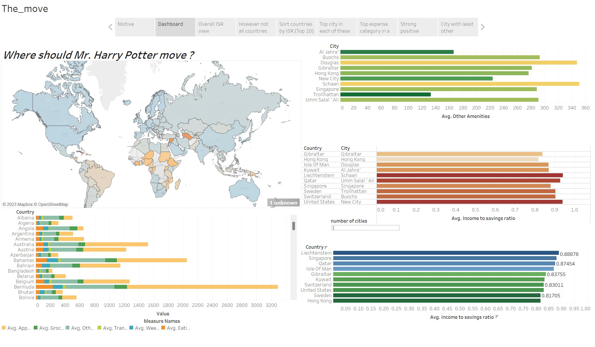

# Exploratory-data-analysis-and-visualization
Determining the best place in the world to relocate using global cost of living dataset and visualizing using tableau
----------------

The ipynb file shows the exploratory data analysis of the dataset in Google colab.

The twb file shows the visulaization using tableau, the story borad along with the dashboard of the cleaned dataset obtained from the colab.

csv file is the kaggle visualization dataset - global cost of living

